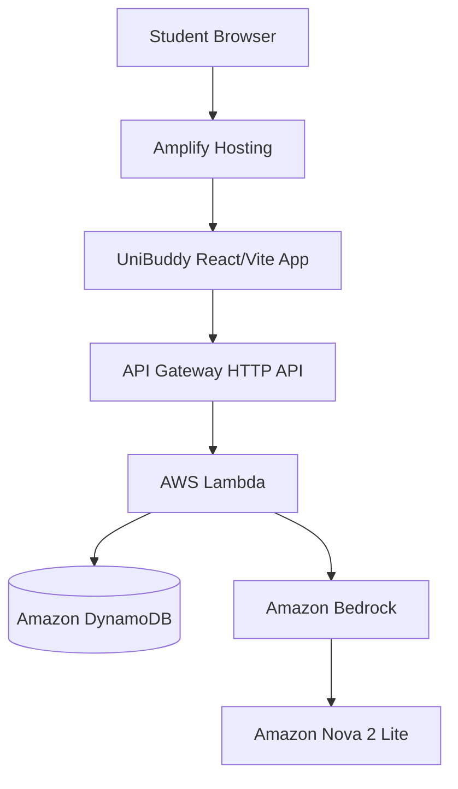

# UniBuddy

UniBuddy is an all-in-one student productivity workspace combining budgeting, study resources, progress tracking, study groups, and an AI study/life assistant in one calm interface.

## AWS architecture



- **Amplify Hosting** serves the React/Vite frontend with Git-based CI/CD.
- **API Gateway + Lambda** provide the backend API.
- **DynamoDB** stores the student's synced workspace state.
- **Amazon Bedrock** powers Ask UniBuddy using Amazon Nova 2 Lite.
- The browser keeps a local copy so the demo remains usable during a temporary network interruption.

## Main flows

### Budget
Add expenses in the Budget screen. Workspace updates are sent to the AWS API and persisted in DynamoDB.

### Resource Hub
Save study links and notes in the Resources screen. These resources are included in the synced workspace state.

### Ask UniBuddy
The assistant sends the student's question plus lightweight app context to the backend. Lambda invokes Amazon Bedrock and returns the response.

### Progress and study groups
Progress records and joined groups are part of the same synced workspace model.

## Local development

This repo is a pnpm workspace. Install dependencies and run the frontend from the repository root:

```bash
pnpm install
pnpm --filter @workspace/consigliere run dev
```

For a deployed backend, set the Vite environment variable below in the frontend build environment:

```text
VITE_API_BASE_URL=https://YOUR_API_ID.execute-api.ap-south-1.amazonaws.com
```

Do not put AWS credentials in frontend code or commit them to the repository.

## AWS deployment

See [`AWS_DEPLOYMENT.md`](./AWS_DEPLOYMENT.md) for the console steps for DynamoDB, Lambda, API Gateway, Bedrock permissions, and Amplify Hosting.

## Demo note

The current authentication is intentionally lightweight for the hackathon prototype. A real production release should use Amazon Cognito instead of storing a password in browser localStorage.
