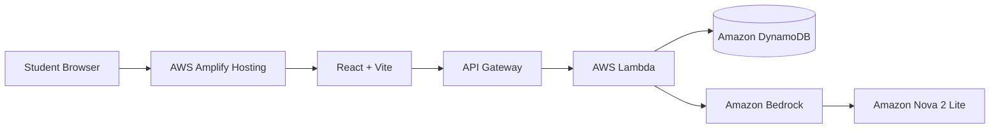

# UniBuddy

> **One workspace for the messy reality of student life.**

UniBuddy is an AI-powered student workspace that brings together budgeting, study resources, progress tracking, study groups, and an AI student assistant in one place.

### 🚀 Live Demo

**[Open UniBuddy](https://main.d34pitc5fh7b7e.amplifyapp.com/)**

### 🎯 The Problem

Students often manage different parts of college life across disconnected apps:

* expenses in one place
* study resources somewhere else
* progress tracked manually
* group coordination through messaging apps
* general questions handled through separate AI tools

UniBuddy combines these everyday workflows into a single student-focused workspace.

### ✨ Features

| Feature         | What it does                        |
| --------------- | ----------------------------------- |
| 💰 Budget       | Track student expenses and spending |
| 📚 Resources    | Save useful study links and notes   |
| 🤖 Ask UniBuddy | Get AI-powered student guidance     |
| 📈 Progress     | Track study time and accuracy       |
| 👥 Study Groups | Discover and join study groups      |
| 🔄 Cloud Sync   | Persist workspace data through AWS  |

### 🧠 AI Assistant

Ask UniBuddy can use lightweight workspace context such as:

* recent expenses
* total spending
* saved resources
* study minutes

The frontend sends the request to the backend, where AWS Lambda invokes Amazon Bedrock using the Converse API.

### ☁️ AWS Architecture



### 🔧 AWS Services

| AWS Service         | Role in UniBuddy                                          |
| ------------------- | --------------------------------------------------------- |
| AWS Amplify Hosting | Hosts the React frontend and handles Git-based deployment |
| API Gateway         | Exposes HTTP API endpoints                                |
| AWS Lambda          | Runs backend logic                                        |
| DynamoDB            | Stores synced workspace state                             |
| Amazon Bedrock      | Provides the AI inference layer                           |
| Amazon Nova 2 Lite  | Powers Ask UniBuddy                                       |

### 🔄 Example Request Flow

```text
Student asks:
"I spent too much this week. Help me make a budget."

        ↓

React frontend

        ↓

API Gateway

        ↓

AWS Lambda

        ↓

Amazon Bedrock
(Nova 2 Lite)

        ↓

AI response

        ↓

UniBuddy interface
```

### 🗂️ Project Structure

```text
UniBuddy/
├── artifacts/
│   └── consigliere/          # React/Vite frontend
├── aws/
│   ├── lambda/
│   │   └── index.mjs         # AWS Lambda backend
│   └── lambda-policy.json     # IAM permissions
├── lib/                       # Shared API/client libraries
├── scripts/                   # Development/build scripts
├── AWS_DEPLOYMENT.md          # AWS deployment guide
├── amplify.yml                # Amplify build configuration
├── package.json
├── pnpm-workspace.yaml
└── README.md
```

### 💻 Local Development

Requirements:

* Node.js 24+
* pnpm 10+

Install dependencies:

```bash
pnpm install
```

Run the frontend:

```bash
pnpm --filter @workspace/consigliere run dev
```

For a deployed AWS backend:

```env
VITE_API_BASE_URL=https://YOUR_API_ID.execute-api.ap-south-1.amazonaws.com
```

### 🚀 AWS Deployment

See [`AWS_DEPLOYMENT.md`](./AWS_DEPLOYMENT.md) for the complete deployment process covering:

* DynamoDB
* Lambda
* IAM
* API Gateway
* Amazon Bedrock
* Amplify Hosting

### 🔐 Security Note

UniBuddy is currently a hackathon prototype.

The current account flow is intentionally lightweight and should not be treated as production-grade authentication. A production release should use Amazon Cognito with authenticated API access.

AWS credentials and secrets should never be committed to the repository.

### 🛣️ Future Improvements

* Amazon Cognito authentication
* More granular API authorization
* richer student analytics
* smarter study planning
* expanded collaboration features
* production-grade observability

### 👨‍💻 Built With

**React · TypeScript · Vite · Tailwind CSS · AWS Amplify · API Gateway · Lambda · DynamoDB · Amazon Bedrock · Amazon Nova 2 Lite**

---

### 📄 License

MIT
